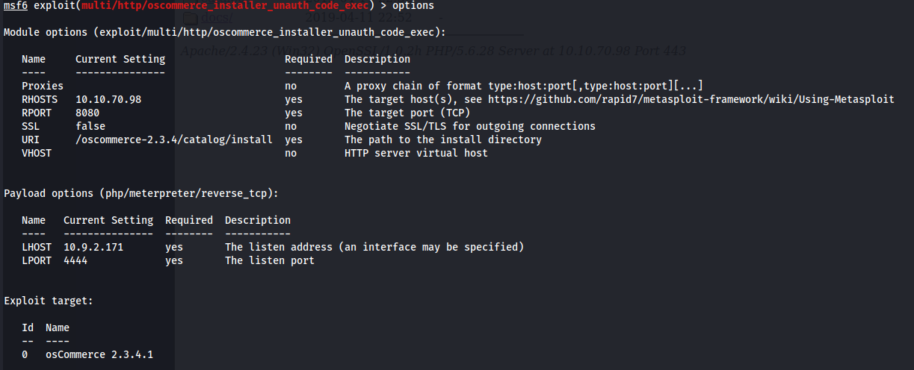

# Blueprint

## [https://tryhackme.com/room/blueprint](https://tryhackme.com/room/blueprint)

## Scanning

After starting the machine, I check if I can ping the host to make sure it is up.

Starting with a standard nmap scan!

Here are the open ports we have found:

* 80/tcp open http Microsoft HTTPAPI httpd 2.0 (SSDP/UPnP)&#x20;
* 135/tcp open msrpc Microsoft Windows RPC&#x20;
* 139/tcp open netbios-ssn Microsoft Windows netbios-ssn&#x20;
* 443/tcp open ssl/http Apache httpd 2.4.23 (OpenSSL/1.0.2h PHP/5.6.28)&#x20;
* 445/tcp open microsoft-ds Windows 7 Home Basic 7601 Service Pack 1 microsoft-ds (workgroup: WORKGROUP)&#x20;
* 3306/tcp open mysql MariaDB (unauthorized)&#x20;
* 8080/tcp open http Apache httpd 2.4.23 (OpenSSL/1.0.2h PHP/5.6.28)&#x20;
* 49152/tcp open msrpc Microsoft Windows RPC&#x20;
* 49153/tcp open msrpc Microsoft Windows RPC&#x20;
* 49154/tcp open msrpc Microsoft Windows RPC&#x20;
* 49158/tcp open msrpc Microsoft Windows RPC&#x20;
* 49159/tcp open msrpc Microsoft Windows RPC 49160/tcp open msrpc Microsoft Windows RPC

It appears we are dealing with a Windows 7 machine on SP1.

Out of curiosity, I will check port 80, 443 and port 8080 to see if there's anything interesting on there.

The catalog folder under the oscommerce-2.3.4 brings us to a site that doesn't appear to be very functional**.**&#x20;

## Gaining Access/Exploitation

Let's bring up metasploit to see if there's anything worth our time. The second one looks interesting. Let's try that.

Should look like this:

### First flag

After running it, we get a meterpreter shell! Here's our first (second?) flag!

We need to get the "Lab" user's NTLM hash for our second and last flag. Trying to run hashdump throws an error and I wasn't able to do it with this shell. Let's create a payload and try to upload that to the machine.

Let's set up a listener with the port we specified when we created the payload.

Execute the payload!

Success!

### Second flag

.png>)

Used crackstation [https://crackstation.net/](https://crackstation.net) for this one but hashcat or john could be used here with your wordlist of choice.
